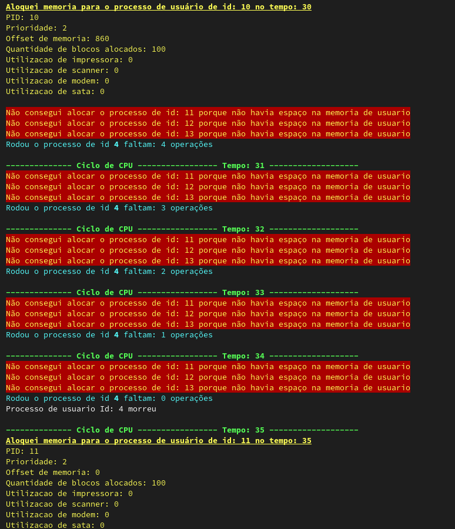

# Trabalho de implementação de um Pseudo-SO.

## Disciplina: Fundamentos de Sistemas Operacionais
## Semestre: 2023.2
## Professora: Aletéia Patrícia Favacho de Araújo
## Alunos: 
    - Paulo Alvim Alvarenga - 170153657
    - Jonas Soares Rangel - 170146804

O trabalho foi realizado de acordo com as espeificações presentes no arquivo "Trabalho_Implementacao_FSO_2023.pdf". 

A estrutura de pastas desse repositório deve se manter tal qual a fonte, para que o CMake consiga realizar a configuração do projeto corretamente. Foram divididos os arquivos `.cpp` na pasta `src` e os arquivos `.hpp` na pasta `include`, como é o padrão de diversos projetos. Dentro dessas pastas não há mais divisões, devido a ser um projeto relativamente simples e com poucos arquivos a serem divididos.

## Compilação:
Para compilar, espera-se que o usuário tenha em sua máquina o software `CMake`, além de ser capaz de compilar códigos com `gcc` ou `g++`.

Para realizar a compilação, deve-se utilizar o comando `cmake .`, seguindo de `make` na raiz deste diretório.

## Cores:
Esse trabalho utiliza-se de cores no terminal para uma melhor visualização, é possível que as cores vistas no programa possam ser diferentes do esperado, caso o terminal utilizado não ofereça suporte a todas as cores 8/16 cores. 

Em caso de dúvida, ver: [Este link](https://misc.flogisoft.com/bash/tip_colors_and_formatting#terminals_compatibility).

Exemplo de output colorido:

### Módulo de processos:
A gerência de processo foi programada majoritariamente pelo aluno Paulo Alvim, e está contida principalmente nos arquivos `src/main.cpp`, e nos arquivos `Processo` e `ProcessoManager` nas suas devidas localizações. 

No arquivo `main`, é feita a leitura do arquivo `processes.txt` que será utilizado para determinar a ordem e atributos dos processos a serem simulados. Além disso, é nele que é contido o loop principal da aplicação que roda enquanto houverem processos para serem alocados ou processos que não terminaram de rodar ainda. 

O algoritmo utilizado para os processos que rodam nas filas de usuário foi o Shortest Job First, onde foi checado o tempo restante para cada processo de sua fila de prioridade através do atributo `timeLeft` das instâncias de `Processo`. Essa mesma váriável é diminuida cada vez que o processo é executado através da sua função `run`.

A principal classe que roda o escalonador e outras gerências é a `ProcessoManager`, em especial sua função `run()` que é rodada a toda iteração do loop principal.
### Módulo de filas:
O Módulo de filas também está presente principalmente no arquivo `ProcessoManager`, que mantém 3 filas de prioridade para processos de usuário além de uma fila de processos em tempo real, que rodam sem preempção.

O algoritmo para os processos de tempo real é um FIFO sem preempção e também sem a possibilidade de serem adquiridos recursos.

O _aging_ é realizado nesse mesmo arquivo, através da função  `ProcessoManager::ageProcesses` e para sua lógica, caso um processo passe 20 tempos de processador na fila de indice 3, ele é rebaixado para a prioridade 2, caso ele passe 30 tempos de processador na fila de prioridade 2, ele é rebaixado para a fila de prioridade 1, onde ele não pode mais ser rebaixado e terá que aguardar sua vez de rodar nessa fila.

### Módulo de Memória:
Ainda dentro do arquivo `main`, é feito o processamento inicial dos processos a serem alocados, sendo determinado se há memória para este processo no momento que ele é entregue para a gerência de processos pelo escalonador. Caso não haja, esse processo é descartado e não irá ser colocado nas filas para ser rodado.

As mémorias de usuário e de tempo real são localizadas dentro da instância da classe `ProcessoManager`, em suas variáveis `memoriaProcessosUsuario` e `memoriaProcessosTempoReal`. Ambas são do tipo `MemoryVector` que tem seus próprios arquivos e cuida de funções comuns à mémoria tal como separar uma mémoria desalocada em um pedaço alocado e um desalocado além de fazer a junção de áreas de mémoria desalocadas por processos diferentes, mas contíguas. As unidades mais simples de memória são guardadas em instâncias da classe `MemorySpace` que serve apenas como uma estrutura para guardar dados uteis tais como se ela está sendo ocupada, qual processo está ocupando ela e qual seu offset comparado com o início do seu bloco de memória. 
### Módulo de Recurso:
O módulo de recurso é utilizado pelo gerenciador de processos através de uma instância da classe `IOManager`, criada no construtor do gerenciador de processos. 

A gerência de recursos é feita utilizando simples estruturas de dados, instâncias da classe `DispositivoIO`, que são consultadas pelo gerenciador de processos na hora de seu escalonamento. Como os dispositivos de IO não são preemptáveis, é feita apenas uma consulta para saber se todos os recursos que um processo demanda já estão com ele, ou se ele pode os adiquirir e em caso positivo, ele é um processo candidato a ser executado pela CPU. Em caso contrário, ele não será executado pela CPU e irá aguardar até que seus recursos demandados sejam liberados. 

Um recurso só é liberado quando um processo termina sua execução e "morre". 

### Módulo de Arquivos:
O gerenciamento de arquivos foi desenvolvido pelo aluno Jonas Rangel e está nos arquivos `src/FileManager.cpp`. O gerenciamento é feito pela classe MemoryManager que utiliza design de projeto singleton para garantir a existência de um único gerenciador para o SO. O gerenciador possúi as operações de ler o arquivo de inicial `files.txt` Adicionar Arquivo e Deletar Arquivo. Para gerenciamento dos arquivos foi utilizada uma pseudo tabela FAT onde são guardadas tuplas que contém o nome do arquivo, seu endereço inicial e seu tamanho.